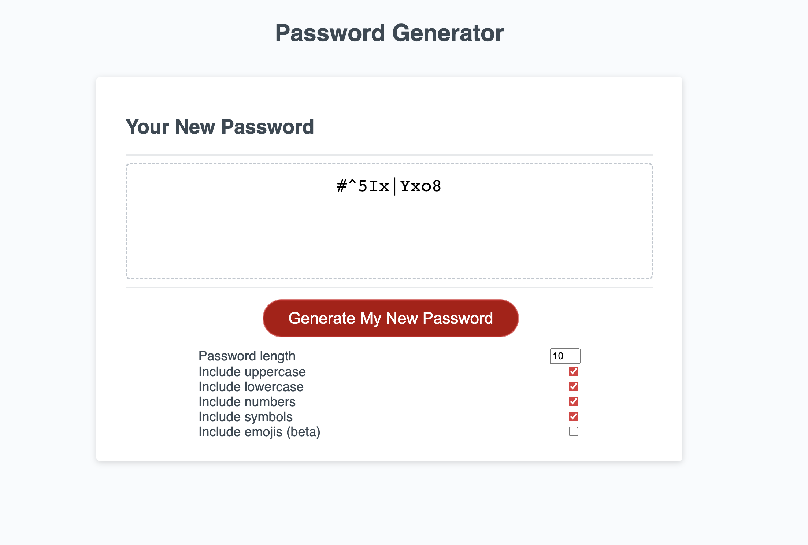

# Challenge-N3-PasswordGen
Generate your new personalized password with one click!

## **ABOUT THE PROJECT**

This password generator uses input elements to generate a random password. The code still needs refinement, and it's a little repetitive. Including emojis in the passwords resulted in some errors due to the .plit and .slice methods that tend to cut the emojis in half from a string.

 

The resources applied for this site are the following:

* For the HTML:
    * Input elements, such as checkboxes and fields.
    * Buttons
* For the CSS:
    * Flex
    * :hover to show checkboxes.
* For JavaScript
    * .getElementById() method to assign constants to input elements in the HTML
    * Const let and var declarations
    * Objects
    * Arrays
    * Functions and methods
        * Arrow Functions
        * Math.random (to choose random elements from an array, string, or CharCode)
        * String.fromCharCode (to find characters for random generation)
        * Ifs
        * Fors
        * .filter (to filter true values from an array)
        * Object.values (to return an array from the true values previously filtered)
        * .split (to separate characters from a string)
        * .sort (to shuffle characters from an array previously split, along with a Math.random func)
        * .join (to join the array into a string)
        * .addEventListener (on click, to execute various events.)
    * Alerts (inside ifs to give feedback to the user)
## **USAGE**

The site will respond to your device size. The checkboxes and input elements reveal when you hover over the button.
You need to check at least one box, and the length of the password can't be smaller than 6 or bigger than 30. [Get your new password!](https://rod-freedom.github.io/Challenge-N3-PasswordGen/)

## **CREDITS**

The tutorial from Traversy Media was essential for completing this task. [JavaScript Password Generator.](https://www.youtube.com/watch?v=duNmhKgtcsI)

All the code is processed, edited, and enhanced by [Rod's Freedom (Rodrigo Lavalle).](https://github.com/Rod-Freedom)
